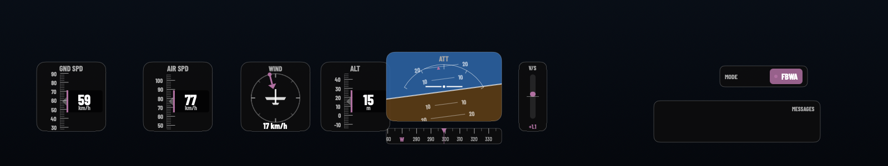

# Skyline

Telemetry overlays for ArduPilot flights — a native macOS app.

Skyline reads an ArduPilot `.bin` dataflash log and renders a transparent,
DJI-style HUD overlay to composite over your flight footage. No command line,
no Python — just a Mac app.



## Download

Grab the latest `.dmg` from the [Releases](https://github.com/brendan779/SkylineOverlay/releases) page.

Requires **macOS 14 Sonoma or later** (Apple silicon & Intel).

### Opening it the first time

Skyline isn't notarised by Apple, so macOS Gatekeeper will block it on first
launch. This is expected. After opening it once, it launches normally.

1. Open `Skyline.dmg` and drag **Skyline** into your **Applications** folder.
2. In Terminal, run:
   ```
   xattr -dr com.apple.quarantine /Applications/Skyline.app
   ```
3. Open Skyline from Applications as normal.

Alternatively, double-click the app, dismiss the warning, then go to
**System Settings → Privacy & Security** and click **Open Anyway**.

## What it does

- **DJI-style HUD** — artificial horizon, speed and altitude tapes, heading and
  wind compasses, vertical speed, flight mode and status messages.
- **Fully tunable** — move, resize, recolour and toggle every widget, with
  snap-to-grid alignment.
- **Live preview** — scrub or play the telemetry in real time, and composite
  your flight video behind it to dial in sync.
- **Transparent export** — renders a ProRes 4444 `.mov` with a real alpha
  channel for Final Cut, DaVinci Resolve and Premiere.

## Building from source

```
git clone https://github.com/brendan779/SkylineOverlay.git
cd SkylineOverlay
open Skyline.xcodeproj
```

Build and run with Xcode, or produce a distributable disk image:

```
./build-dmg.sh
```

This builds the Release configuration and writes `site/Skyline.dmg`.

## License

Skyline is unaffiliated with ArduPilot and DJI. Use overlays at your own
discretion.
